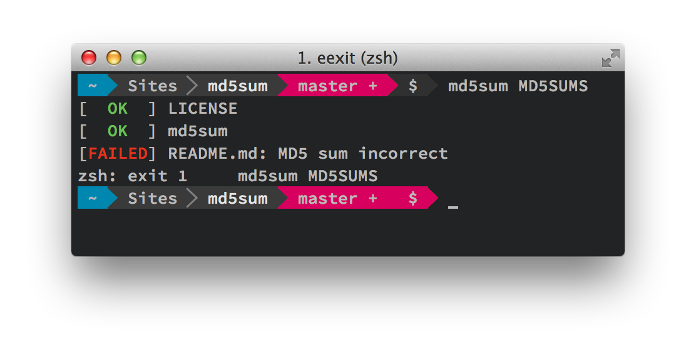

# md5sum for OSX


		
## Installation

```bash
sudo curl https://raw.githubusercontent.com/eexit/md5sum/master/md5sum -o /sbin/md5sum
sudo chmod a+x /sbin/md5sum
```

## Usage

### Synopsis

	md5sum [-q] source_file
	md5sum [-v] [-h]

Reads MD5 (128-bits) checksums in the file and compare them to the files

	-q
		Quiet mode. Don't print OK messages or warnings messages

	-h
		Displays this help and exits

	-v
		Outputs the version information and exits

## How to generate a valid MD5SUMS file

The default OSX `md5 -r` command [doesn't generate a valid format](http://blog.eexit.net/sh-md5sum-c-like-for-mac-osx/):

	$ md5 -r LICENSE
	95baec3fa8136f631e8b7bad5460d7b6 LICENSE
	# It should output:
	95baec3fa8136f631e8b7bad5460d7b6  LICENSE

In order to fix this, you can extends the `md5` this way:

	$ md5 -r LICENSE | sed 's/ /  /'
	95baec3fa8136f631e8b7bad5460d7b6  LICENSE

If you need to generate a valid `MD5SUMS` format for many files in one command:

```bash
$ find . -not -empty -type f -d 1 | \
xargs -I %s basename %s | xargs -I %s md5 -r %s | sed 's/ /  /'
95baec3fa8136f631e8b7bad5460d7b6  LICENSE
ccbd9f1144351424c0afbc9a9b5df021  md5sum
f9e4c933069ab3c67006dbbd8e9a8840  README.md
```

### Author

Written by Joris Berthelot <admin@eexit.net>  
https://github.com/eexit/md5sum
